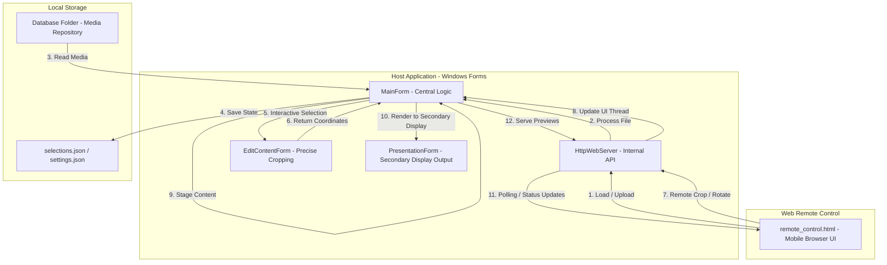

# Dreams LIVE Solutions Presenter App

A robust .NET-based presentation tool that allows users to load, crop, and present images and PDFs on a secondary display, with full remote control capabilities via a mobile-friendly web interface.

## Repository Workflow Diagram

## Workflow Description

### 1. Media Acquisition
- **Host Loading:** Users can browse for images/PDFs directly on the PC or drag and drop them onto the main preview.
- **Remote Upload:** Users can capture photos with a mobile camera or upload files via the web remote. All uploads are funneled through the `HttpWebServer` and optionally stored in the configured `Database Folder`.

### 2. Region Selection and Editing
- **Interactive Crop:** On the host PC, users can drag and resize a red selection rectangle over the source media.
- **Remote Editor:** The web remote features a specialized `Cropper.js` interface for intuitive touch-based selection.
- **Edit Modal:** A dedicated `EditContentForm` on the host allows for precise, aspect-ratio-locked cropping while maintaining cumulative manual rotations.

### 3. Staging and Pre-Visualization
- **Staging Preview:** Before going live, content is "staged" to a secondary preview area (gray dotted box on the source). This renders exactly what *would* appear on the projector if pushed.
- **High-Resolution Rendering:** For PDFs, the staging logic performs high-quality (300+ DPI) renders, ensuring the final output is crisp.

### 4. Presentation
- **Go Live:** Pushing content sends the staged region to the `PresentationForm`.
- **Live Sync:** If "Auto Send" is enabled, any movement or adjustment on the host or remote is instantly reflected on the secondary display.
- **Blackout:** A dedicated feature to immediately clear the secondary display without losing the current staging state.

### 5. Synchronization & State
- **Polling Loop:** The remote control polls the `/status` endpoint every second to stay synchronized with the host's active file, selection coordinates, and PDF page numbers.
- **Thread Safety:** The `HttpWebServer` uses `Invoke/BeginInvoke` to safely communicate with the Windows Forms UI thread.
- **Persistence:** User settings and image-specific selection regions are persisted in JSON files within the user's AppData directory.
